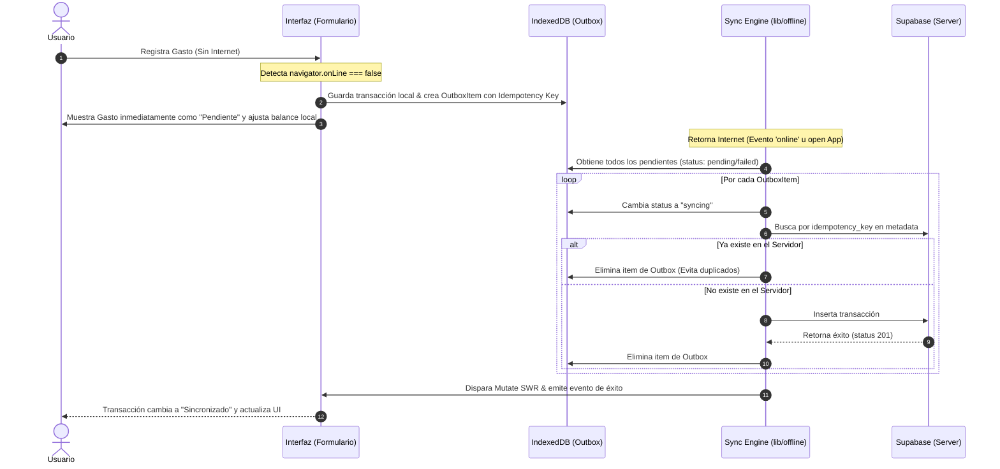

# Arquitectura Offline-First: Captura de Gastos y Sincronización (MVP)

Este documento detalla el diseño técnico, la arquitectura de almacenamiento, el motor de sincronización y las limitaciones de la implementación **Offline-First** en MiCuadre.

---

## 1. Diagnóstico del Problema y Objetivos
Anteriormente, MiCuadre dependía al 100% de la conectividad a Internet para registrar cualquier tipo de gasto. Si un usuario intentaba añadir una transacción sin conexión o con una red inestable:
1. La llamada a Supabase fallaba.
2. La interfaz de usuario mostraba un error abrupto.
3. El usuario se veía obligado a recordar el gasto para registrarlo más tarde, lo cual deteriora gravemente la propuesta de valor del producto.

**Objetivo de este MVP**:
Habilitar una experiencia móvil fluida que permita registrar gastos e ingresos de forma instantánea de forma local, actualizando de inmediato los balances simulados en la UI, y garantizando la sincronización automática en segundo plano (background sync) cuando la conexión retorne, sin duplicar transacciones ni perder datos.

---

## 2. Arquitectura de Almacenamiento Local (IndexedDB)

Para no saturar el almacenamiento síncrono limitado de `localStorage`, hemos estructurado una base de datos local robusta e independiente en el navegador usando **IndexedDB** (`micuadre-offline`), aislada mediante identificadores del usuario (`user_id`) para evitar la filtración de datos financieros entre distintas sesiones.

### Almacenes Creados (`stores`):
*   **`transactions_cache`**: Almacena las transacciones del servidor de manera local para permitir la lectura offline del historial.
*   **`accounts_cache`**: Guarda el estado de las cuentas del usuario (efectivo, débito, crédito) para habilitar el dashboard offline.
*   **`offline_outbox`**: Cola de operaciones de escritura pendientes (Outbox pattern).
*   **`sync_errors`**: Registro histórico de fallas de sincronización para que el usuario pueda revisarlas o reportarlas.

### Estructura de un Item en `offline_outbox`:
```typescript
interface OutboxItem {
  id: string; // ID local del cliente (ej. local_tx_12345)
  operation: "create_transaction";
  entity: "transactions";
  payload: {
    account_id: string;
    category_id: string | null;
    type: "expense" | "income";
    amount: number;
    currency: "DOP" | "USD";
    description: string;
    date: string; // formato YYYY-MM-DD
    notes: string | null;
    applyCommission?: boolean;
    // ...resto del payload
  };
  status: "pending" | "syncing" | "failed";
  retry_count: number;
  created_at: string; // ISOString
  last_attempt_at: string | null;
  last_error: string | null;
  idempotency_key: string; // Clave única generada en el cliente
}
```

---

## 3. Flujo de Captura y Sincronización



### Prevención de Duplicación (Idempotencia)
Para evitar crear registros duplicados si una petición HTTP tiene éxito pero la conexión se corta antes de recibir la respuesta, generamos un `idempotency_key` en el cliente (`idem_timestamp_random`).
Este `idempotency_key` se guarda dentro de la columna `metadata` (JSONB) en Supabase. Antes de realizar cualquier inserción durante la sincronización, el motor consulta a Supabase:
```javascript
const { data: existing } = await supabase
  .from("transactions")
  .select("id")
  .eq("metadata->>idempotency_key", item.idempotency_key)
  .maybeSingle()
```
Si encuentra una coincidencia, descarta la inserción y elimina el elemento de la cola de salida de forma segura.

---

## 4. Experiencia de Usuario (UX) y Estados de Conexión

### Estados Visuales de una Transacción:
1.  **Sincronizada (Normal)**: Sin indicadores especiales. Se asume guardada en Supabase.
2.  **Pendiente de sincronizar (`offline_pending` / `pending`)**: Se muestra con un badge color ámbar que dice **"Pendiente"**.
3.  **Sincronizando (`syncing`)**: Muestra un indicador dinámico animado **"Subiendo..."**.
4.  **Error en Sincronización (`failed`)**: Muestra un badge rojo de **"Error"** y expone el mensaje exacto de error debajo de la transacción (ej. "Llegaste al límite de cuentas", "Fondos insuficientes", etc.).

### Banner Flotante de Estado (`OfflineStatusBanner`):
*   Aparece en la parte inferior de la pantalla (justo arriba del menú de navegación, a `bottom-24` para no tapar los botones de acción).
*   En estado **Offline**: Muestra un pill con un icono de Wi-Fi apagado indicando `Modo offline · X pendientes` o `Sin conexión`.
*   En estado **Online** con cola pendiente: Muestra el conteo de elementos y provee un botón destacado **"Sincronizar"** o **"Reintentar"** que fuerza el vaciado del outbox.
*   En éxito de sincronización: Muestra un pill verde temporal con un checkmark `¡Movimientos sincronizados!`.

---

## 5. Automatización y Prefill en la Captura

Para minimizar los toques de pantalla necesarios para registrar un gasto (vital en movilidad offline), se agregaron tres características premium:
1.  **Memoria de Cuenta y Moneda**: El formulario de gastos almacena la última cuenta y moneda seleccionada de manera local (`localStorage`). Al abrir la pantalla de nuevo, se preseleccionan automáticamente.
2.  **Plantillas Rápidas ("Frecuentes / Repetir rápido")**: Se analizan las últimas transacciones registradas localmente en el historial del cliente y se extraen los 4 gastos más recurrentes. Se renderizan como pills de acceso rápido (ej. `Uber RD$350`). Al pulsarlas, completan todo el formulario en 1 clic.
3.  **Sugerencias Inteligentes por Descripción (Heurística Local)**: Al escribir un concepto (ej. "Café"), la app busca en el historial local y sugiere automáticamente la cuenta, categoría y el monto del último gasto similar. Un botón flotante le permite al usuario autocompletar con un toque.

---

## 6. Limitaciones de Plataforma y Notas de iOS/Safari

*   **Background Sync Limitado en iOS**: iOS (Safari/WebKit) restringe severamente las tareas en segundo plano de los Service Workers y no soporta completamente la API de Background Sync estándar de Chrome.
*   **Estrategia de Mitigación**: MiCuadre implementa un sistema híbrido que no depende únicamente del Service Worker:
    1.  Escucha el evento nativo del navegador `window.addEventListener("online")`.
    2.  Registra un listener en `document.addEventListener("visibilitychange")` para ejecutar la sincronización inmediatamente cuando la app vuelve al primer plano o se enfoca (`window.addEventListener("focus")`).
    3.  Ofrece un botón manual en el banner flotante para que el usuario pueda forzar la subida en cualquier momento.
*   **Persistencia de IndexedDB**: En iOS, si el dispositivo se queda muy bajo de almacenamiento, Safari puede purgar IndexedDB de aplicaciones PWA que no han sido añadidas a la pantalla de inicio si no se abren en 7 días. Se recomienda instalar la app como PWA para máxima retención de almacenamiento.

---

## 7. Plan de Pruebas y Checklist de Control de Calidad (QA)

Para verificar el correcto funcionamiento offline de forma segura, siga estos casos de prueba usando Chrome DevTools:

| ID | Escenario de Prueba | Acción a Realizar | Resultado Esperado |
| :--- | :--- | :--- | :--- |
| **TC-01** | Transición a Offline | Activar modo Offline en DevTools (Network tab). | El banner flotante muestra "Estás sin conexión · Modo local". |
| **TC-02** | Registro Offline | Crear un gasto de RD$250 en la cuenta de Efectivo estando Offline. | El balance en pantalla disminuye por RD$250, el gasto aparece al tope de la lista con el badge "Pendiente". |
| **TC-03** | Persistencia Offline | Recargar la app (F5) mientras se sigue offline. | El gasto pendiente y el balance recalculado persisten (se leen de IndexedDB). |
| **TC-04** | Sincronización Automática | Desactivar el modo Offline en DevTools. | El motor detecta conexión, sincroniza en segundo plano, el badge "Pendiente" desaparece y se muestra el banner de éxito. |
| **TC-05** | Prevención de Duplicados | Simular reintento de envío de un OutboxItem con idempotency key ya existente. | El motor detecta el duplicado en Supabase, no inserta una segunda transacción y limpia el Outbox sin error. |
| **TC-06** | Aislamiento de Sesión | Iniciar sesión con otro usuario. | El outbox y los caches del usuario anterior se borran por completo (`clearAllCaches`) para preservar la privacidad financiera. |

---

## 8. Plan y Roadmap para Automatización Futura

### Fase 1: Captura de Foto y OCR Offline (En cola)
*   **Flujo**: El usuario toma foto de un recibo sin internet.
*   **Almacenamiento**: La foto se guarda como un Blob binario en IndexedDB.
*   **Acción**: Se crea un OutboxItem de tipo `upload_receipt` apuntando a la foto local.
*   **Sincronización**: Al retornar online, la foto se sube a Supabase Storage y se dispara un Edge Function con IA (Gemini) para extraer monto, ITBIS, comercio y categoría, auto-completando la transacción.

### Fase 2: Captura de Voz Local
*   **Flujo**: El usuario presiona un botón de micrófono offline y graba una nota de voz corta (ej. "gasté 150 pesos en café en Starbucks con la tarjeta popular").
*   **Almacenamiento**: El audio se guarda en IndexedDB. Al volver online, se procesa mediante Speech-to-Text y se autocompleta el gasto.

### Fase 3: Framework Local-First Completo
*   Si la complejidad de la sincronización de múltiples entidades crece (ej. presupuestos colaborativos, metas compartidas), se evaluará migrar la capa de persistencia a un sistema como **PowerSync** o **RxDB** acoplado a Supabase, reemplazando el outbox manual por sincronización reactiva bidireccional sobre SQLite.
